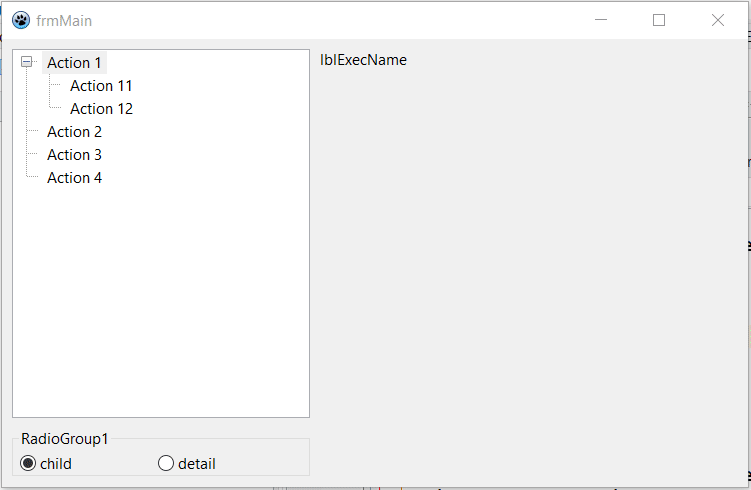
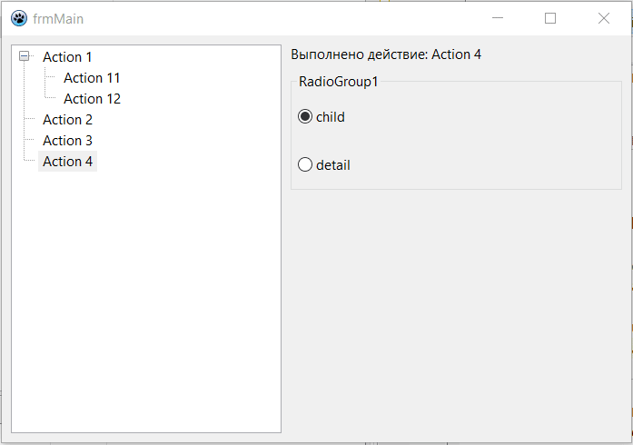
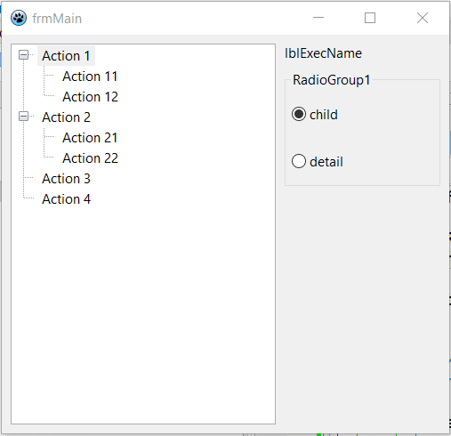

# laz_vtv_serialize

#### This project forms a tree structure in third-party modules using an array of Record type entries, then deserializes/transforms them into tree nodes of the main window. In this case, a list of the TActionList type is passed from the subordinate module, clicking on the node triggers the execution of a certain action associated with the subordinate module.

=====================================

2026.03.30.1
- implemented the creation and calling of a child window from unit_child and returning the result to the main window

2026.03.27.1
- the mechanism of calling the event handler associated with the node is implemented

2026.03.26.2
- a common TPseudoTreeClass class is highlighted with redefinition of inheritance in dependent modules.

**Implemented serialization/deserialization of the structure**

